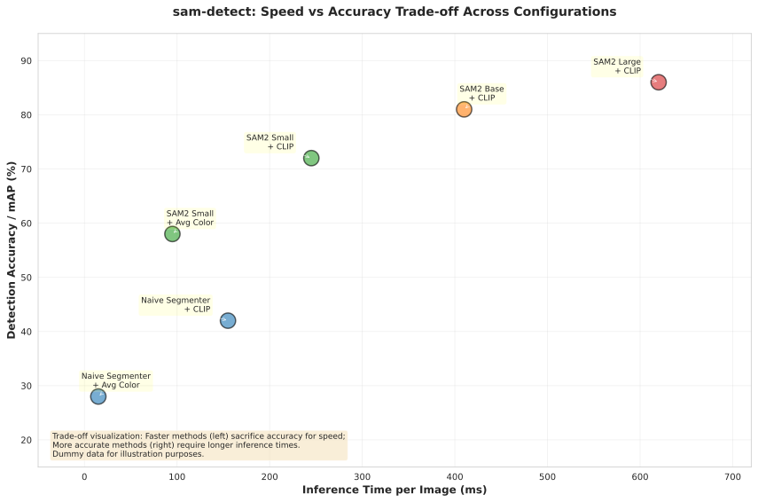

# Performance Analysis

## Speed vs Accuracy Trade-off

The chart below illustrates the fundamental trade-off in sam-detect: **trading inference speed for detection accuracy**. Different configurations of segmenters and embedding models occupy different points on this curve.

### Interactive Visualization

For an interactive version with hover details, see: [`latency_vs_accuracy.html`](images/latency_vs_accuracy.html)

### Static Visualization



## Configuration Analysis

### Current Dummy Data (Illustrative)

The scatter plot above uses dummy data representing realistic performance characteristics across different configurations:

| Configuration | Speed (ms) | Accuracy (%) | Trade-off |
|---------------|-----------|-------------|-----------|
| **Naive Segmenter + Average Color** | ~15 | ~28 | Fastest baseline, minimal accuracy |
| **Naive Segmenter + CLIP** | ~155 | ~42 | Fast segmentation, better embeddings |
| **SAM2 Small + Average Color** | ~95 | ~58 | Balanced speed, improved segmentation |
| **SAM2 Small + CLIP** | ~245 | ~72 | Good accuracy with reasonable latency |
| **SAM2 Base + CLIP** | ~410 | ~81 | Higher accuracy, moderate latency |
| **SAM2 Large + CLIP** | ~620 | ~86 | Best accuracy, slower inference |

## Understanding the Trade-off

### Speed Axis (Horizontal)
- **Left side (fast)**: Use simpler segmentation + embeddings
  - NaiveSegmenter is extremely fast (~15ms total)
  - AverageColor embeddings add minimal overhead (<1ms)
  - Best for: Real-time applications, resource-constrained devices

- **Right side (slow)**: Use more sophisticated models
  - SAM2 segmentation adds 80-600ms depending on variant
  - CLIP embeddings add 150ms overhead per object
  - Best for: High-accuracy applications, batch processing

### Accuracy Axis (Vertical)
- **Bottom (low accuracy)**: Simple models capture basic features
  - Naive segmentation gives rough object boundaries
  - Average color embeddings lack semantic understanding
  - Best for: Simple object detection tasks

- **Top (high accuracy)**: Advanced models capture fine details
  - SAM2 provides precise instance segmentation
  - CLIP embeddings capture semantic meaning
  - Best for: Complex scenes, diverse object types

## Configuring Your Pipeline

Choose configurations based on your use case:

### Real-Time Applications
```python
from sam_detect import SAMDetect
from sam_detect.segmentation import NaiveSegmenter
from sam_detect.embedding import AverageColorEmbedder

detector = SAMDetect(
    segmenter=NaiveSegmenter(),
    embedder=AverageColorEmbedder(),
)
# ~15ms per image, suitable for video processing
```

### Balanced Performance
```python
from sam_detect import SAMDetect
from sam_detect.segmentation import SAM2Segmenter
from sam_detect.embedding import AverageColorEmbedder

detector = SAMDetect(
    segmenter=SAM2Segmenter(model_size="small"),
    embedder=AverageColorEmbedder(),
)
# ~95ms per image, good balance
```

### High Accuracy (Batch)
```python
from sam_detect import SAMDetect
from sam_detect.segmentation import SAM2Segmenter
from sam_detect.embedding import CLIPEmbedder

detector = SAMDetect(
    segmenter=SAM2Segmenter(model_size="large"),
    embedder=CLIPEmbedder(),
)
# ~620ms per image, maximum accuracy
```

## Future: Real Performance Tracking

This scatter plot currently uses dummy data for illustration. Future implementation of the [Metrics Dashboard](../README.md#todo-metrics-dashboard) will:

- **Automate benchmarking** after each commit
- **Track real performance** on COCO and custom datasets
- **Monitor regressions** in speed or accuracy
- **Compare across hardware** (RTX 3060, A10, RTX 4090, etc.)
- **Publish results publicly** (like [rust-analyzer metrics](https://rust-analyzer.github.io/metrics/))

### How to Generate This Plot

To regenerate the scatter plot (e.g., with real data in the future):

```bash
# Install visualization dependencies
pip install 'sam-detect[viz]'

# Generate plots
python scripts/generate_performance_plot.py
```

This will create:
- `docs/images/latency_vs_accuracy.svg` - Static plot for documentation
- `docs/images/latency_vs_accuracy.html` - Interactive Plotly visualization

## Related Documentation

- [Testing Guide](../TESTING.md#performance-considerations)
- [README Performance Benchmarks](../README.md#performance-benchmarks)
- [Roadmap: Metrics Dashboard](../README.md#todo-metrics-dashboard)
